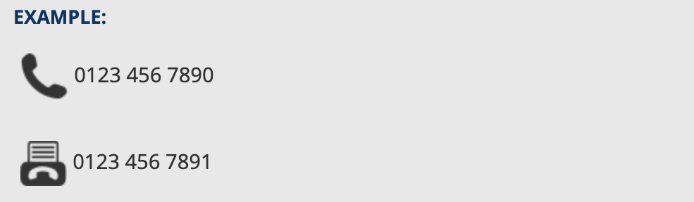
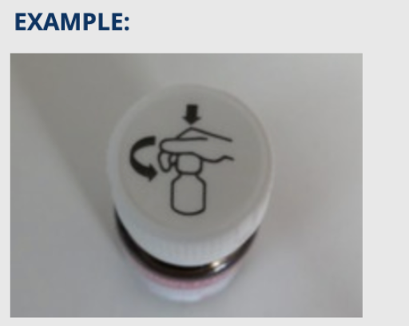
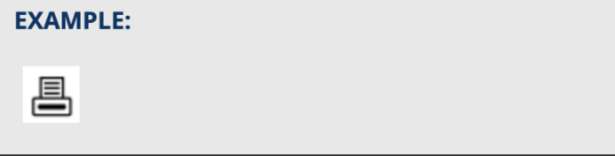
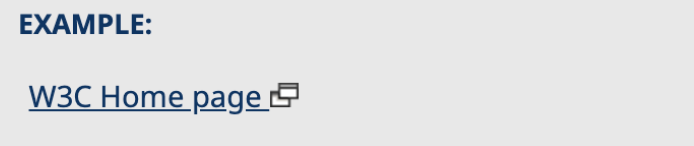
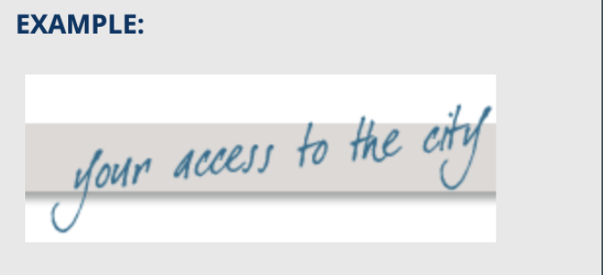
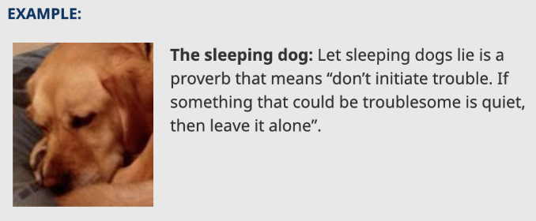
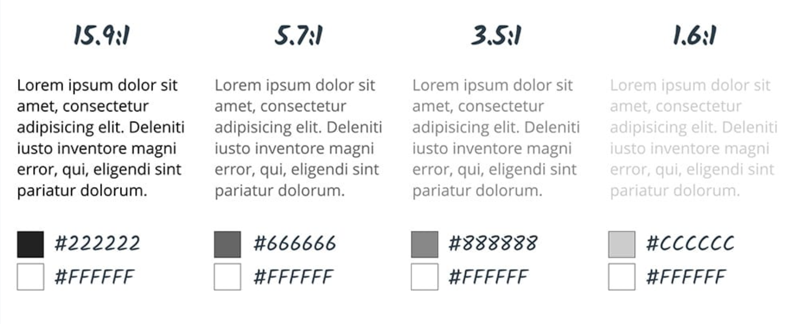

This resources have been created by [Erin Doyle](https://github.com/erin-doyle) as part of her egghead React a11y workshop.
 
I have collated the different parts of her workshop into a single file in order to quickly access this resources in the future.

# Landmark Regions
Landmark regions are used by screen readers to make it easier for users 
to navigate the content on the page

## HTML5 elements and ARIA roles for Landmark regions

| HTML5 element | ARIA role              | Use both?                                                                 |
| ------------- | ---------------------- | ------------------------------------------------------------------------- |
| `<header>`    | `role=”banner”`        | Only when a descendant of an article, aside, main, nav or section element |
| `<nav>`       | `role=”navigation”`    | No                                                                        |
| `<main>`      | `role=”main”`          | No                                                                        |
| `<footer>`    | `role=”contentinfo”`   | Only when a descendant of an article, aside, main, nav or section element |
| `<aside>`     | `role=”complementary”` | No                                                                        |
| `<section>`   | `role=”region”`        | Only if the section element does NOT have an accessible name              |
| `<article>`   | `role=”article”`       | No                                                                        |
| `<form>`      | `role=”form”`          | No                                                                        |
| none          | `role=”search”`        | N/A                                                                       |


## Landmark Examples
* [HTML5](code_examples/html5_example.html)
* [ARIA Attributes](code_examples/aria_attributes_example.html)

## References
* http://www.a11ymatters.com/article/intro-html5-sectioning-elements/
* https://dequeuniversity.com/assets/html/jquery-summit/html5/slides/landmarks.html
* https://www.w3.org/TR/html-aria/#docconformance

**********************

# Heading Levels
Heading levels are used by screen readers to make it easier for users to 
navigate the content on the page

## Rules
* Each page should have at least one `<h1>`
* Pages should be structured in a hierarchical manner
    * `<h1>`: being the most important (usually page titles or main content heading)
    * `<h2>`: usually major section headings
    * `<h3>`: sub-sections of the `<h2>`
    * and so on
* Do not skip heading levels 
    * always follow consecutive order	
* Do not use text formatting, such as font size or bold to give the visual appearance of headings 
    * use actual heading (`<h1>` - `<h6>`) for all content headings
* Do not use headers to achieve visual results only

## References
* https://webaim.org/techniques/semanticstructure/
* https://www.w3.org/WAI/tutorials/page-structure/headings/ 

**********************

# Labels
Labelling inputs, elements and widgets add context and clarity for screen readers.

## `<label>` elements
Use `<label>` element for labeling `<input>` elements:
* Either wrap the `<input>` that’s being labeled
```html
<label>Some Field:
   <input type="text" name="myField" />
</label>
```
* Or use the `htmlFor` attribute (in React, otherwise `for`) with the id of the `<input>` being labeled
```html
<label htmlFor="someField">Some Field:</label>
<input id="someField" type="text" name="myField"/>
```

## `aria-label` attributes
Use `aria-label` for non `<input>` elements
(such as a `<button>` or an `<icon>` that does not have its own descriptive text)
```html
<button onClick="myDialog.close()" aria-label="Close”>
    X
</button>
```
```html
<i class="icon-close" aria-label="Close” />
```

## `aria-labeledby` attributes
Takes a string of one or more ids of elements that themselves provide a label
* Use with one element or a grouping of elements or a widget
* Use Cases: 
    * Combine multiple labels together
    * Associate headings with regions
    * Label for a widget
```html
<div id="billing">Billing</div>
<div>
    <div id="name">Name</div>
    <input type="text" aria-labelledby="billing name"/>   
</div>
```
```html
<div role="main" aria-labelledby="foo">
    <h1 id="foo">
        Wildfires spread across the San Diego Hills
    </h1>
    <p>
        Strong winds expand fires ignited by high temperatures ...
    </p>
</div>
```

## `aria-describedby` attributes
Works the same as aria-labelledby but provides extended information. Good for: 
* providing instructions
* important usage details
```html
<div 
    role="application" 
    aria-labelledby="calendar"  
    aria-describedby="info"
>
    <h1 id="calendar">Calendar</h1>
    <p id="info">
        This calendar shows the game 
        schedule for the Boston Red Sox.
    </p>
    <div role="grid">
        ...
    </div>
</div>
```

***************

# Images
Images must have text alternatives that describe the information or function 
represented by them so they can be read and understood by those using screen readers.

## Alternative text for images
* All `` elements should have an `alt` attribute provided
    * When not provided many screen readers will fallback to reading the file name instead
* The `alt` value should not include words like _“image”_, _“picture”_ or _“icon”_
    * Screen readers are already announcing that the element is an image
* Images that are decorative only and provide no information or function to the page should be hidden from Assistive 
Technologies by providing an empty `alt` attribute (`alt=””`)
    * Make sure the value is empty and does not include a space character (ex. `alt=” “`)

## Informative Images
Images that graphically represent concepts and information.
* `alt` should be a short description conveying the essential information 
presented by the image

### Example 1

```html
<p>
    
    0123 456 7890
</p>
<p>
    
    0123 456 7891
</p>
```

### Example 2

```html

```

## Functional Images
Images used to initiate actions rather than to convey information, 
typically in `buttons`, `links`, and other interactive elements
* `alt` should convey the action that will be initiated (the purpose of the image), 
rather than a description of the image

### Example 1

```html
<a href="javascript:print()">
    
</a>
```

### Example 2

```html
<a href="https://w3.org" target="_blank">
    W3C Home Page 
    
</a>
```

## Images of text
Image displaying text that is meant to be read
* Better design practice is to use actual text that is styled with CSS rather 
than image-based text presentation
* But if you must… `alt` should contain the same exact text contained in the image

### Example

```html

```

## Decorative Images
Only add visual decoration to the page - they do not add any additional 
information that is important to understanding the page.
* Text values for these types of images would add audible clutter to screen 
reader output or could distract users
* `alt` should be provided but empty (without any space characters!)

### Example

```html
<p>
    
    <strong>The sleeping dog:</strong> 
    Let sleeping dogs lie...
</p>
```

## References
* https://www.w3.org/WAI/tutorials/images/
* https://www.w3.org/WAI/tutorials/images/decision-tree/
* https://www.w3.org/WAI/tutorials/images/tips/
* https://www.w3.org/WAI/tutorials/images/informative/
* https://www.w3.org/WAI/tutorials/images/functional/
* https://www.w3.org/WAI/tutorials/images/textual/

**********************

# Color Contrast
When contrast between foreground and background colors is not sufficient it can 
be hard to distinguish outlines, borders, edges, and details and text can be 
hard to read.

## Contrast Ratios


## Do not use color alone to convey meaning
**WCAG 2.1 Level A requirement:** Color is not used as the only visual means of conveying 
information, indicating an action, prompting a response, or distinguishing a visual element.

* Impacted Users:
    * vision impaired or older users
    * cognitive impaired
    * temporarily limited such as experiencing screen glare
* Impact:
    * These users may not be able to see/understand the differences in color and require additional indicators
* Solution:
    * Along with color, use additional indicators such as:
        * typography
        * shapes
        * grids
        * spaces
        * and/or allocate more weight to important elements

## References
* https://webaim.org/resources/contrastchecker/
* https://color.review/
* https://www.scottohara.me/blog/2019/02/12/high-contrast-aria-and-images.html
* [Css media query: -ms-high-contrast](https://www.gwhitworth.com/blog/2017/04/how-to-use-ms-high-contrast/)

**********************

# Focus Management
Keyboard/screen reader navigation relies on focus proceeding in a logical 
order and not getting lost such that the user does not know where they are 
or how to get back to the desired point in a web page.

## Rules for focus
* Focus should begin at the first focusable element on each page
* When content is added or removed from the DOM in response to a user-initiated event:
    * Shift focus to the new content that is added
    * Move the focus to the next logical spot on the web page when content is removed
* Make sure focus doesn't jump to the top of the web page or becomes lost after a user-fired event.
* Be sure to move focus to an area on the web page that has discernible text for screen readers to convey to users.
* Keep order linear/logical so screen reader users don’t feel lost or lose context

## Using refs
A ref is a variable that references a given DOM element
* The ref attribute on the element can be passed the variable or a callback to set the variable (support depends on React version)
* Then focus() can be called on the ref variable, either:
    * During a desired point in the component lifecycle, (i.e. componentDidMount componentDidUpdate, or useEffect)
    * After a user initiated event (i.e. button onClick, or some element being removed from the DOM, etc)

### Examples
* [< React 16.3 example](code_examples/pre_React_16.3_example.js)
* [>= React 16.3 example](code_examples/post_React_16.3_example.js)
* [>= React 16.8 stateless functional component example](code_examples/post_React_16.8_stateless_example.js)

## References
* https://www.w3.org/TR/wai-aria-1.1/#managingfocus
* https://developers.google.com/web/fundamentals/accessibility/focus/
* https://reactjs.org/docs/accessibility.html#programmatically-managing-focus 
* https://reactjs.org/docs/accessibility.html#programmatically-managing-focus
* https://reactjs.org/docs/refs-and-the-dom.html
* https://reactjs.org/docs/hooks-reference.html#useref
    * https://medium.com/@teh_builder/ref-objects-inside-useeffect-hooks-eb7c15198780
* https://www.gatsbyjs.org/blog/2019-07-11-user-testing-accessible-client-routing/

*************

# Live Regions
When dynamic changes occur to content on a page they are usually visually 
apparent to users who can see the page but may not be made apparent to users 
of assistive technologies. ARIA live regions provide a way to make those 
dynamic content changes able to be announced by assistive technologies.

## Rules for defining live regions
* The live region must first be present (and usually empty), so that the browser 
and assistive technologies are aware of it
    * Dynamically adding an element defined as a live region, or adding the live 
    region attributes to an element after initial load will have no effect
    * The live region must be present first and only then should the content be 
    changed
* Any subsequent changes to the live region will be announced
* Distinct attributes can be used to define the screen reader behavior for live 
regions or specialized roles may be used for more common use cases

## ARIA attributes
* [`aria-live`](https://www.w3.org/WAI/PF/aria-1.1/states_and_properties#aria-live) - defines the priority with which the screen reader will read updates to the region - values include:
    * `off` - the default setting - won’t read updates to the region
    * `polite` - the screen reader will wait to read updates to the region once it is idle
    * `assertive` - the screen reader will interrupt whatever it may be currently reading to read any updates to the region
* [`aria-atomic`](https://www.w3.org/WAI/PF/aria-1.1/states_and_properties#aria-atomic) - 
`true` or `false` as to whether or not the screen reader should always present the live region as a whole, even if only part of the region changes
* [`aria-relevant`](https://www.w3.org/WAI/PF/aria-1.1/states_and_properties#aria-relevant) - takes a list of what type of changes should be announced (default is “additions text”) - values include:
    * `additions` - any insertions of any nodes into the live region
    * `removals` - any removals of any nodes from the live region
    * `text` - any changes to textual content within the live region
    * `all` - equivalent to `additions removals text`
    
## Specialized roles
For more common use cases and/or widgets should prefer the available specialized ARIA roles for live regions:
* [`status`](https://www.w3.org/WAI/PF/aria-1.1/roles#status) - a status bar or area of the screen that provides an updated status of some kind. Screen reader users have a special command to read the current status.
* [`alert`](https://www.w3.org/WAI/PF/aria-1.1/roles#alert) - error or warning message that flashes on the screen. Alerts are particularly important for client side validation notices to users. 
* [`progressbar`](https://www.w3.org/WAI/PF/aria-1.1/roles#progressbar) - a hybrid between a widget and a live region. Use this with aria-valuemin, aria-valuenow and aria-valuemax.
* [`marquee`](https://www.w3.org/WAI/PF/aria-1.1/roles#marquee) - for text which scrolls, such as a stock ticker.
* [`timer`](https://www.w3.org/WAI/PF/aria-1.1/roles#timer) - any kind of timer or clock, such as a countdown timer or stopwatch readout.
* [`log`](https://www.w3.org/WAI/PF/aria-1.1/roles#log) - chat, error, game or other type of log.

## References
* https://developer.mozilla.org/en-US/docs/Web/Accessibility/ARIA/ARIA_Live_Regions
* https://www.w3.org/WAI/PF/aria-1.1/states_and_properties#aria-live
* https://www.w3.org/WAI/PF/aria-1.1/states_and_properties#aria-atomic
* https://www.w3.org/WAI/PF/aria-1.1/states_and_properties#aria-relevant
* http://html.cita.illinois.edu/nav/form/aria/index.php?example=3

********

# Interaction/Design Patterns
Although elements that are natively keyboard accessible should be used when 
possible, there are times when HTML falls short and custom "widgets" are 
necessary. Complex menus, sliders, dialogs, tab panels, etc. must all be built 
to support keyboard and screen reader accessibility.

## Widget behavior expectations
* For more complex widgets there are expectations by keyboard and screen reader users as to how these specific widgets will behave and can be navigated
* Interactions must be intuitive and predictable
* Events triggered by mouse clicks should also be able to be triggered via keyboard
* The state of the widget should always be clear

[Interaction/Design Patterns](https://www.w3.org/TR/wai-aria-practices-1.1/#aria_ex) 
define the specific interaction requirements for the widget:
* What ARIA roles should be defined on which elements making up the widget
* What ARIA states should be provided to which parts of the widget and under what scenarios should which values apply
* What other ARIA properties should be set on which parts of the widget
* What event handling should be implemented to support keyboard navigation (i.e. which keyboard keys should trigger what behavior in the widget)

## Tablist Design Pattern
### ARIA Roles: 
* The element that serves as the container for the set of tabs has [`role="tablist"`](https://www.w3.org/TR/wai-aria-1.1/#tablist)
* Each element that serves as a tab has [`role="tab"`](https://www.w3.org/TR/wai-aria-1.1/#tab) and is contained within the element 
with `role="tablist"`
* Each element that contains the content panel for a tab has [`role="tabpanel"`](https://www.w3.org/TR/wai-aria-1.1/#tabpanel)

### Labeling:
* If the tab list has a visible label, the element with `role="tablist"` uses `aria-labelledby`, 
otherwise use `aria-label`
* Each element with `role="tabpanel"` has the property `aria-labelledby` referring to its associated
tab element

### Attributes:
* Each element with `role="tab"` has the property [`aria-controls`](https://www.w3.org/TR/wai-aria-1.1/#aria-controls) referring to its associated 
tabpanel element
* The active tab element has the state [`aria-selected`](https://www.w3.org/TR/wai-aria-1.1/#aria-selected) set to `true` and all other tab elements have
it set to `false`

### Keyboard interaction
#### tablist focus: 
* When focus moves into the `tablist`, place focus on the active `tab` element
* When the `tablist` contains the focus, moves focus to the next element in the page tab sequence 
outside the `tablist`

#### When focus is on a tab:
* Left Arrow: moves focus to the previous `tab`. If the first `tab`, moves focus to the last `tab`
* Right Arrow: Moves focus to the next `tab`. If the last `tab` element, moves focus to the first `tab`
* Space or Enter: Activates the `tab` if it was not activated automatically on focus
* Home (Optional): Moves focus to the first `tab`. Optionally, activates the newly focused `tab`
* End (Optional): Moves focus to the last `tab`. Optionally, activates the newly focused `tab`


## Toolbar
A container for grouping a set of controls, such as `buttons`, `menubuttons`, or `checkboxes`
* Use as a grouping element only if the group contains 3 or more controls

### Keyboard interaction
* Focus starts on the first control that is not disabled. Optionally, if the toolbar has previously 
contained focus, focus is set on the control that last had focus.
* Left Arrow: Moves focus to the previous control. Optionally, focus movement may wrap from the 
first element to the last element.
* Right Arrow: Moves focus to the next control. Optionally, focus movement may wrap from the last 
element to the first element.
* Home (Optional): Moves focus to first element.
* End (Optional): Moves focus to last element.


## References
* https://www.w3.org/TR/wai-aria-practices-1.1/#aria_ex
* https://inclusive-components.design/
* https://a11yproject.com/patterns/
* https://webaim.org/techniques/keyboard/
### Tablist:
* https://www.w3.org/TR/wai-aria-practices/#tabpanel
* https://www.w3.org/TR/wai-aria-1.1/#tablist
* https://www.w3.org/TR/wai-aria-practices/examples/tabs/tabs-1/tabs.html
### Toolbar:
* https://www.w3.org/TR/wai-aria-practices/#toolbar 
* https://www.w3.org/TR/wai-aria-practices/examples/toolbar/toolbar.html 
